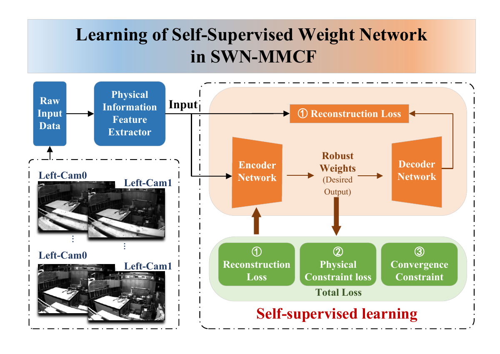

# SWN-MMCF

SWN-MMCF integrates a self-supervised weight network and multi-kernel maximum correntropy filtering with OpenVINS for robust visual-inertial state estimation.

[SWN-MMCF inference demo](swn-mmcf-demo.mp4)

## Environment

### Network training

Network training is an offline Python workflow and does not require ROS, OpenCV, Eigen, Ceres, or an OpenVINS build. The current code reads preprocessed `.npz` samples, trains the encoder/decoder with PyTorch, saves a `.pth` checkpoint, and optionally exports the inference encoder to ONNX.

The network training environment used in this project is:

| Component | Version / configuration |
|---|---|
| Python | 3.12.12 |
| pip | 25.3 |
| PyTorch | 2.9.1+cu130 |
| Torchvision | 0.24.1+cu130 |
| PyTorch CUDA Runtime | 13.0 |
| cuDNN | 9.12 |

The code automatically selects CUDA when `torch.cuda.is_available()` is true and otherwise runs on CPU.


The training entry point is `train.py`, while `model.py` contains feature normalization, the encoder, the training-only decoder, and the ONNX deployment graph.

### SWN-MMCF inference

The inference environment follows the standard [OpenVINS](https://github.com/rpng/open_vins) environment. Install and build OpenVINS using its official [installation guide](https://docs.openvins.com/gs-installing.html), then add ONNX Runtime C/C++ and the exported `swn_stage6.onnx` model to the `ov_msckf` package. The implementation supports the same ROS 1, ROS 2, and ROS-free configurations provided by OpenVINS.

The current ROS 2 workspace can be built with:

```bash
source /opt/ros/$ROS_DISTRO/setup.bash
colcon build --symlink-install --cmake-args -DCMAKE_BUILD_TYPE=Release
source install/setup.bash
```

Enable SWN-MMCF in the OpenVINS estimator configuration:

```yaml
use_swn_mmcf: true
swn_mmcf_model_path: /absolute/path/to/swn_stage6.onnx
```

OpenVINS citation:

```bibtex
@inproceedings{Geneva2020ICRA,
  title     = {{OpenVINS}: A Research Platform for Visual-Inertial Estimation},
  author    = {Patrick Geneva and Kevin Eckenhoff and Woosik Lee and Yulin Yang and Guoquan Huang},
  booktitle = {Proceedings of the IEEE International Conference on Robotics and Automation},
  year      = {2020},
  address   = {Paris, France},
  url       = {https://github.com/rpng/open_vins}
}
```

## Data input

Training samples are collected at visual measurement-update times. Raw stereo images and IMU measurements are first processed by the visual-inertial front end and the physical-information feature extractor. Each sample contains the multi-kernel scale vector, prior error state, visual innovation, measurement Jacobian, measurement-noise diagonal, prior covariance, valid measurement/state masks, and the physical target formed from the innovation and its Mahalanobis statistic.

Variable-size MSCKF systems are padded to a fixed measurement/state size before feature concatenation. In the current OpenVINS integration, the packed network input has 40,661 elements and the encoder outputs 52 normalized robust kernel weights. The training `.npz` file uses:

- `feature`: packed physical-information features with shape `[N, D]`;
- `physics_target`: physical reconstruction target with shape `[N, P]`;
- additional aligned numeric arrays used during self-supervised training.



[Figure 2 in PDF format](figure2.pdf)

## Inference with OpenVINS

SWN-MMCF is inserted into the MSCKF visual-update stage of OpenVINS. OpenVINS continues to perform sensor synchronization, IMU propagation, initialization, feature tracking, camera-state cloning, measurement construction, marginalization, and state publication. When `use_swn_mmcf` is enabled, the standard MSCKF EKF update is replaced by the SWN-MMCF robust update.

The inference sequence is:

1. **Sensor processing:** OpenVINS receives IMU and camera measurements, propagates the IMU state and covariance, tracks stereo features, and augments the sliding-window camera clones.
2. **MSCKF measurement construction:** valid feature tracks are triangulated and projected into the left null space. OpenVINS forms the compressed residual vector `r`, Jacobian `H`, measurement covariance `R`, and the active prior covariance `P`.
3. **Canonical state mapping:** the active OpenVINS error state is mapped to the Stage-6 order consisting of IMU attitude, biases, velocity, position, camera-0 extrinsics, and active pose clones. Measurement and state dimensions are padded and accompanied by validity masks.
4. **Network input packing:** the kernel scales, zero error-state prior, padded residual, row-major Jacobian, measurement-noise diagonal, prior covariance, validity masks, innovation, and Mahalanobis statistic are concatenated into the fixed-length physical feature vector.
5. **Weight-network inference:** the ONNX encoder receives input tensor `x` and returns `alpha`, a normalized vector of robust multi-kernel weights.
6. **MMCF fixed-point update:** the predicted weights are used by the multi-kernel correntropy fixed-point iteration to evaluate the prior and measurement robust factors. Iteration continues until the state correction converges or the iteration limit is reached.
7. **Full OpenVINS state update:** the robust factors scale the prior and measurement contributions. The Kalman gain is then computed with the complete OpenVINS Jacobian so that IMU, clone, camera, stereo, intrinsic, and time-offset states remain correctly coupled. The state mean and covariance are updated in the full OpenVINS state space.
8. **Normal OpenVINS continuation:** OpenVINS performs its normal clone/feature marginalization, publishes the estimated pose and diagnostic topics, and processes the next sensor measurements.

```text
IMU + stereo images
        |
        v
OpenVINS propagation, tracking and MSCKF measurement construction
        |
        v
Stage-6 feature packing -> ONNX weight network -> robust weights alpha
        |                                      |
        +---------- SWN-MMCF fixed point <-----+
                           |
                           v
             Full-state OpenVINS update
                           |
                           v
          Marginalization and pose publication
```
